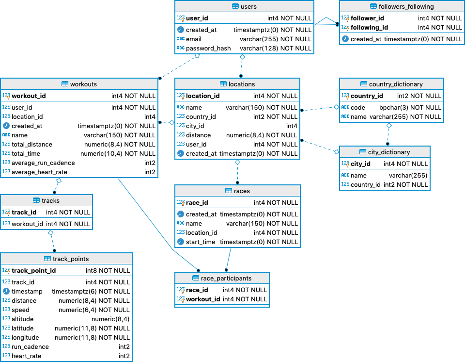

# БД онлайн-сервиса для спортсменов-бегунов

Этот проект является частичным клоном популярной социальной спортивной сети Strava (с рядом упрощений). Он позволяет
спортсменам делиться друг с другом информацией о забегах и маршрутах, а также анализировать результаты тренировок и
соревнований.

Структура таблиц и их полей будет дополняться по мере разработки проекта.

## Диаграмма БД



## Таблицы

### users

Таблица пользователей сервиса. Пользователи аутентифицируются по паре "E-mail + пароль", сам пароль при этом хранится в
БД в виде хэша.

#### Поля таблицы

| Поле | Описание | Кардинальность | Доп. ограничения |
| --- | --- | --- | --- |
| user_id | ID пользователя | Совпадает с кол-вом строк | – |
| created_at | Момент создания записи | Почти равна кол-ву строк | – |
| email | E-mail пользователя | Совпадает с кол-вом строк | – |
| password_hash | Хэш пароля | Почти равна кол-ву строк | – |

#### Дополнительные индексы

| Поля | Тип индекса | Описание |
| --- | --- | --- |
| created_at | Обычный | Фильтрация и сортировка пользователей по дате |
| email | UNIQUE | Обеспечение уникальности E-mail |

#### Примеры запросов с использованием индексов

```postgresql
SELECT u.email,
       u.created
FROM users u
ORDER BY u.created DESC
LIMIT 100
```

### followers_following

Таблица социальных связей между пользователями.

Примеры пользовательских сценариев:

- пользователь начал отслеживать забеги и результаты другого пользователя.
- пользователь перестал отслеживать забеги и результаты другого пользователя.

#### Поля таблицы

| Поле | Описание | Кардинальность | Доп. ограничения |
| --- | --- | --- | --- |
| created_at | Момент создания записи | Почти равна кол-ву строк | – |
| follower_id | Пользователь, который подписался | ≈ 1/10 от кол-ва строк users | – |
| following_id | Пользователь, на которого подписались | ≈ 1/10 от кол-ва строк users | – |

#### Специфические индексы

| Поля | Тип индекса |
| --- | --- |
| follower_id, following_id | Первичный ключ |

#### Дополнительные индексы

| Поля | Тип индекса | Описание |
| --- | --- | --- |
| created_at | Обычный | Фильтрация и сортировка социальных связей по дате |
| following_id | Обычный | Поиск подписчиков заданного пользователя |

#### Примеры запросов с использованием индексов

```postgresql
SELECT ff.following_id,
       COUNT(*) AS followers_count
FROM followers_following ff
GROUP BY ff.following_id
HAVING COUNT(*) > 10
ORDER BY followers_count DESC 
```

### country_dictionary

Словарь стран мира. В основе лежат трёхсимвольные коды ISO 3166-1. Я рассматривал вариант использования кода в качестве
первичного ключа, но пока не принял окончательное решение.

#### Поля таблицы

| Поле | Описание | Кардинальность | Доп. ограничения |
| --- | --- | --- | --- |
| country_id | ID страны | Совпадает с кол-вом строк | – |
| code | Код страны по ISO | Совпадает с кол-вом строк | [A-Z]{3} |
| name | Наименование страны | Совпадает с кол-вом строк | – |

#### Дополнительные индексы

| Поля | Тип индекса | Описание |
| --- | --- | --- |
| code | UNIQUE | Обеспечение уникальности кодов |

### city_dictionary

Словарь городов с привязкой к странам.

#### Поля таблицы

| Поле | Описание | Кардинальность | Доп. ограничения |
| --- | --- | --- | --- |
| city_id | ID города | Совпадает с кол-вом строк | – |
| name | Наименование города | Почти равна кол-ву строк | – |
| country_id | ID страны | ≈ 1/100 от кол-ва строк | – |

### locations

Маршруты забегов. Эти маршруты добавляют и именуют сами пользователи. Маршрут должен быть привязан к конкретной стране,
но город – это необязательное поле.

Примеры пользовательских сценариев:

- спортсмен несколько раз провёл тренировки (workouts) в одном и том же месте и хочет создать на их основе маршрут
- организаторы забега создают маршрут для будущих соревнований (races)

#### Поля таблицы

| Поле | Описание | Кардинальность | Доп. ограничения |
| --- | --- | --- | --- |
| location_id | ID маршрута | Совпадает с кол-вом строк | – |
| created_at | Момент создания записи | Почти равна кол-ву строк | – |
| name | Наименование маршрута | Почти равна кол-ву строк | – |
| user_id | ID пользователя | ≈ 1/50 от кол-ва строк | – |
| country_id | ID страны | ≈ 300 | – |
| city_id | ID страны | ≈ 10000 | – |
| distance | Дистанция, м | Почти равна кол-ву строк | 0 < N ≤ 200000 |

#### Дополнительные индексы

| Поля | Тип индекса | Описание |
| --- | --- | --- |
| created_at | Обычный | Фильтрация и сортировка забегов по дате |
| distance | Обычный | Фильтрация и сортировка забегов по дистанции |

#### Примеры запросов с использованием индексов

```postgresql
SELECT l.location_id,
       l.name,
       l.distance
FROM locations l
WHERE l.country_id = 100
  AND l.distance > 10000
ORDER BY distance
```

### workouts

Конкретные забеги. Их добавляют сами пользователи, обычно – путём импорта данных из спортивных приложений. Забеги могут,
но не обязаны, быть привязаны к маршруту (locations). Статистические данные (total_distance и total_time) – это
денормализованные значения, которые вычисляются на основе импортированных данных.

Примеры пользовательских сценариев:

- пользователь загрузил с помощью приложения данные о последнем забеге
- пользователь изменил наименование забега
- сервис сформировал аналитические данные на основе ряда забегов

#### Поля таблицы

| Поле | Описание | Кардинальность | Доп. ограничения |
| --- | --- | --- | --- |
| workout_id | ID забега | Совпадает с кол-вом строк | – |
| created_at | Момент создания записи | Почти равна кол-ву строк | – |
| name | Наименование маршрута | Почти равна кол-ву строк | – |
| location_id | ID маршрута | ≈ 1/100 от кол-ва строк | – |
| total_distance | Дистанция, м | Почти равна кол-ву строк | 0 < N ≤ 200000 |
| total_time | Время, сек | Почти равна кол-ву строк | 0 < N ≤ 3000000 |
| average_run_cadence | Средний каданс (денорм.) | ≈ 100 | 0 < N ≤ 300 |
| average_heart_rate | Средний пульс (денорм.) | ≈ 200 | 0 < N ≤ 300 |

#### Дополнительные индексы

| Поля | Тип индекса | Описание |
| --- | --- | --- |
| created_at | Обычный | Фильтрация и сортировка забегов по дате |
| total_distance | Обычный | Фильтрация и сортировка забегов по дистанции |
| total_time | Обычный | Фильтрация и сортировка забегов по времени |
| average_run_cadence | Обычный | Фильтрация и сортировка забегов по кадансу |
| average_heart_rate | Обычный | Фильтрация и сортировка забегов по пульсу |

#### Примеры запросов с использованием индексов

```postgresql
SELECT w.workout_id,
       w.name
FROM workouts w
WHERE w.location_id = 14
  AND w.total_distance > 10000
```

### tracks

Наборы данных, импортированных из спортивных приложений. Каждый набор данных привязан к конкретному забегу.

Эта таблица будет постепенно дополняться новыми полями по мере анализа задачи.

#### Поля таблицы

| Поле | Описание | Кардинальность | Доп. ограничения |
| --- | --- | --- | --- |
| track_id | ID набора данных | Совпадает с кол-вом строк | – |
| workout_id | ID забега | Совпадает с кол-вом строк | – |

#### Специфические индексы

| Поля | Тип индекса |
| --- | --- |
| track_id, workout_id | Первичный ключ |

### track_points

Спортивные приложения по мере забега фиксируют GPS-координаты бегуна с дополнительной информацией
(скорость, высота над уровнем моря, пульс и т.д.). Набор параметров зависит от используемого ПО и оборудования. Среднее
кол-во срезов на один 10-километровый забег – около 1200.

Эта таблица содержит конкретные срезы из импортированного набора данных. В реальном приложении, скорее всего,
использовались бы альтернативные способы хранения "сырых" данных, но для учебных целей я выбрал именно такой подход.

#### Поля таблицы

| Поле | Описание | Кардинальность | Доп. ограничения |
| --- | --- | --- | --- |
| track_point_id | ID среза | Совпадает с кол-вом строк | – |
| workout_id | ID забега | ≈ 1/1200 от кол-ва строк | – |
| timestamp | Время | Почти равна кол-ву строк | – |
| distance | Дистанция, м | Почти равна кол-ву строк | 0.0000 < N ≤ 200000.0000 |
| speed | Скорость, км/ч | Почти равна кол-ву строк | 0.0000 < N ≤ 50.0000 |
| altitude | Высота над ур.моря, м | Почти равна кол-ву строк | 0.0000 < N ≤ 10000.0000 |
| latitude | Широта | Почти равна кол-ву строк | -90.00000000 ≤ N ≤ 90.00000000 |
| longitude | Долгота | Почти равна кол-ву строк | -180.00000000 ≤ N ≤ 180.00000000 |
| run_cadence | Каданс | ≈ 100 | 0 < N ≤ 300 |
| heart_rate | Пульс | ≈ 200 | 0 < N ≤ 300 |

### races

В этой таблице хранятся спортивные соревнования.

Примеры пользовательских сценариев:

- организаторы соревнования создали новое соревнование и привязали его к маршруту
- пользователи приняли участие в соревнованиях и прикрепили свой забег
- пользователи изучают список победителей

#### Поля таблицы

| Поле | Описание | Кардинальность | Доп. ограничения |
| --- | --- | --- | --- |
| race_id | ID соревнования | Совпадает с кол-вом строк | – |
| created_at | Момент создания записи | Почти равна кол-ву строк | – |
| name | Наименование соревнования | Почти равна кол-ву строк | – |
| location_id | ID маршрута | ≈ 1/100 от кол-ва строк | – |
| start_time | Время начала соревнования | Почти равна кол-ву строк | – |

#### Дополнительные индексы

| Поля | Тип индекса | Описание |
| --- | --- | --- |
| created_at | Обычный | Фильтрация и сортировка соревнований по дате |
| start_time | Обычный | Фильтрация и сортировка соревнований по времени начала |

## race_participants

В этой таблице хранятся участники спортивных соревнований (они прикрепляют свои забеги к соревнованию).

#### Поля таблицы

| Поле | Описание | Кардинальность | Доп. ограничения |
| --- | --- | --- | --- |
| race_id | ID соревнования | Совпадает с кол-вом строк | – |
| workout_id | ID забега | ≈ 1/500 от кол-ва строк | – |

#### Специфические индексы

| Поля | Тип индекса |
| --- | --- |
| race_id, workout_id | Первичный ключ |

## Рекомендации к использованию репликации

Наиболее типичный сценарий использования сервиса – это чтение данных + базовая аналитика. Добавление и изменение данных
происходит намного реже и будет выполняться в асинхронном режиме. Задержка между сохранением данных и их отображением
вполне допустима.

В связи с этим оптимальный вариант репликации на этапе разработки MVP:

- один master; работает только на запись
- 2 slave; работают только на чтение

## Рекомендации к резервному копированию

На этапе разработки MVP требования к резервному копированию выглядят следующим образом:

- настройка Point-in-Time Recovery
- полная резервная копия 1 раз в сутки (выгрузка SQL-дампов на внешний сервер)
- учения по разворачиванию резервной копии – 1 раз в неделю